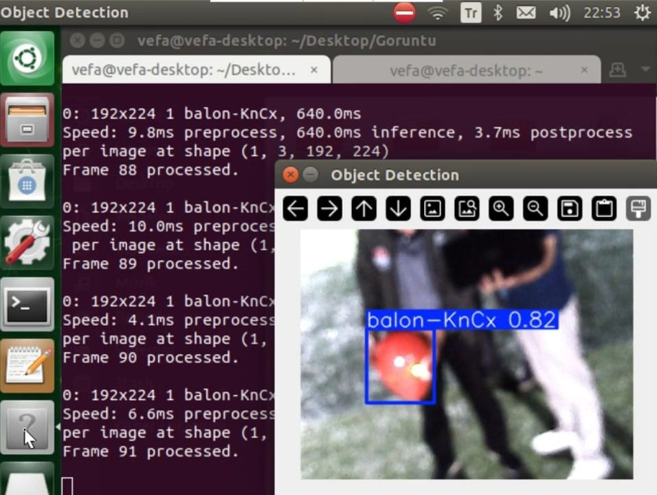

# Drone with Object Detection and QR Code Scanning

This project integrates object detection, QR code scanning, and laser control into a drone system using the **DroneKit** library for UAV control, **YOLOv8** for object detection, and **pyzbar** for QR code scanning. The drone is controlled to follow a specific target (for example, a red balloon is preferred in this project) while scanning QR codes and performing actions based on the detections. If the appropriate position is achieved during the tracking code, the target can be marked with the laser integrated into the drone.

## Functionality
The system performs the following tasks:

1. **Real-time Video Streaming and Processing:** Captures video from the drone's onboard camera and processes it in real-time using YOLOv8. The model is trained to detect specified threat classes (currently "red_balloon," but easily customizable).

2. **Threat Detection and Real-World Coordinate Estimation:** Identifies threats and attempts to estimate their real-world 2D coordinates relative to the drone using camera calibration parameters. Important: Accurate coordinate estimation requires precise camera calibration (intrinsic matrix and distortion coefficients). The provided coordinate estimation is a simplified approximation and might require significant adjustments depending on your camera setup and drone's characteristics.

3. **Autonomous Threat Tracking:** If a threat is detected, the drone attempts to autonomously track the threat by adjusting its position to keep the threat centered in the camera's field of view. The current implementation uses simple simple_goto commands and may require more sophisticated control algorithms for robust tracking.

4. **Laser Pointer Control:** If a threat is locked on and centered, and the necessary hardware is connected, the system can activate a laser pointer attached to the drone (requires appropriate hardware and GPIO configuration).

5. **QR Code Detection and Processing:** Decodes QR codes detected in the video stream. Currently, it only prints the decoded data to the console, but you can extend this functionality to trigger actions or modify the drone's behavior based on the QR code content.

6. **Drone Control:** Uses the DroneKit library for communication with the drone, enabling autonomous takeoff, landing, waypoint navigation (rectangular patrol pattern), and emergency return-to-home (RTL) functionality.

7. **Battery Monitoring:** Monitors the drone's battery level and initiates an RTL maneuver if the battery falls below a user-defined threshold.

## Setup

### 1. Install Python Dependencies
To install the required Python packages, run the following command:

```bash
pip install opencv-python pyzbar dronekit ultralytics numpy
```

If you want to use laser control via **GPIO**, you'll need to install the `RPi.GPIO` library:

```bash
pip install RPi.GPIO
```

For YOLOv8 (object detection), you'll also need the **ultralytics** package:

```bash
pip install ultralytics
```

### 2. YOLOv8 Model
The project uses a pre-trained YOLO model (`best.pt`) located in the `train2/weights/` directory. If you do not have a model, you can train one using **YOLOv8** by following the instructions in the [YOLOv8 documentation](https://github.com/ultralytics/ultralytics).



### 3. Connecting the Drone
- Connect your drone via a serial connection (e.g., USB to serial or telemetry).
- Update the `DRONE_CONNECTION_STRING` variable with the appropriate connection string for your drone, such as `/dev/ttyACM0` or `udp:127.0.0.1:14550` for a simulator.

### 4. Video Stream
- The video stream will be captured from a camera (e.g., a USB camera). Ensure that your camera is properly connected and recognized.
- The video source is set by default to `/dev/video0`, but this can be changed based on your system.

### 5. GPIO for Laser Control
If you're using a Raspberry Pi with a connected laser module, the laser will be controlled via the **GPIO** pin. Modify the **`LASER_PIN`** to match your setup. By default, it's set to GPIO pin 17.

### 6. File Output
The captured frames from the video stream are saved in the `output_frames` directory, with filenames such as `frame_0001.jpg`, `frame_0002.jpg`, etc.

## Usage

### Running the Script
Once everything is set up, you can run the script using:

```bash
python drone_object_detection.py
```

### Drone Flight Modes
1. **Takeoff**: Upon starting the program, the drone will ask for the desired altitude and will take off automatically.
2. **Object Detection**: The YOLO model will continuously analyze the camera feed to detect the target object (e.g., a red balloon).
3. **Follow Mode**: Once a target is detected and centered in the camera feed, the drone will follow the target and activate the laser.
4. **QR Code Detection**: QR codes in the video feed are decoded and displayed on the screen, along with their data.
5. **Low Battery**: The drone monitors its battery level. If it drops below the specified threshold (default 20%), the drone will return to its home location.

### Keyboard Shortcuts
- **q**: Exit the program.
- **d**: Toggle debug mode (shows additional information in the terminal).

### Example Workflow
1. The UAV takes off and starts analyzing the camera feed.
2. It patrols the points whose coordinates are entered.
3. When a red balloon (or other target) is detected during the patrol, the UAV starts tracking the target.
4. If the target is centered and the laser control is enabled, the UAV activates the laser and lands on the QR code.
5. If no target is detected, the patrol is completed and the UAV lands on the QR code.
6. When the battery level drops below a certain level, the UAV returns to its home position.

[Simulation of detecting a red balloon at the first coordinate after take-off](video.gif)

## Troubleshooting

- **No Video Feed**: Ensure the camera is properly connected and the `VIDEO_SOURCE` is correctly set.
- **Connection Errors**: Double-check the drone's connection string and ensure the drone is powered on and ready to communicate.
- **QR Code Not Detected**: Make sure QR codes are clearly visible in the camera feed. You can adjust the camera settings (e.g., exposure, focus) to improve detection.
- **Low Battery**: Ensure that your drone is sufficiently charged. If running on simulation, monitor the simulated battery levels.

## License
This project is licensed under the MIT License - see the [LICENSE](LICENSE) file for details.
